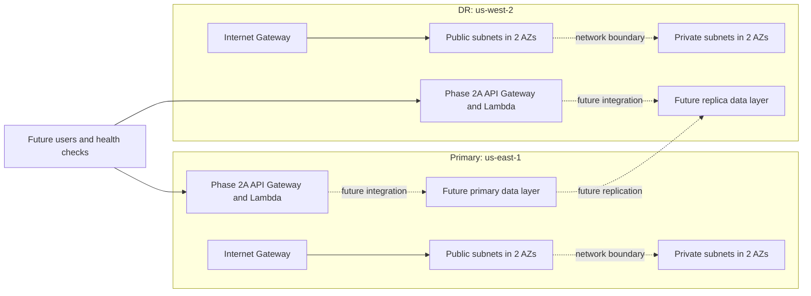

# Phase 1 and Phase 2A Architecture

## Regional topology

## Primary region

`us-east-1` is the normal service region. Phase 1 creates a dedicated VPC,
public subnets, private subnets, an Internet Gateway, and separate public and
private route tables. Resources are spread across two configurable Availability
Zones. Public subnets route internet-bound traffic through the Internet
Gateway; private subnets have no internet default route.

## DR region

`us-west-2` is an independent recovery region with its own VPC and equivalent
subnet topology. It does not depend on primary-region networking. Keeping the
regions structurally similar simplifies recovery testing while preserving
separate regional failure domains.

## Network boundaries

Terraform checks require non-overlapping regional VPC CIDRs, valid and unique
subnet CIDRs contained by their VPC, non-overlapping regional subnets, matching
subnet/AZ counts, distinct regions, and unique AZs belonging to the configured
region. Public and private tiers have distinct route tables.

Each VPC's default security group is explicitly managed with no ingress or
egress rules. No broad replacement rules are added. No additional security
groups, load balancers, databases, NAT Gateways, VPC endpoints, peering, or
cross-region transit links are created in Phase 1.

Private subnets are the intended location for future private compute
integrations and data services. Public subnet classification does not itself
make a resource public; a resource would also need a public address, routing,
and explicitly permitted security controls.

## VPC Block Public Access

The AWS account currently applies VPC Block Public Access with
`InternetGatewayBlockMode = block-ingress` in both regions. This account-level
control blocks Internet Gateway ingress independently of the public route
tables, so Phase 1 does not provide publicly reachable workloads.

The project intentionally leaves this broader security control unchanged.
Phase 2 should use AWS-managed or serverless ingress instead of requiring a
publicly reachable EC2 instance. Any future workload that requires Internet
Gateway ingress must use an explicitly reviewed BPA exclusion or another
appropriate architecture. See
[ADR 0002](../docs/adr/0002-preserve-vpc-block-public-access.md).

## Phase 1 private connectivity decision

NAT Gateways and VPC endpoints are intentionally absent. Phase 1 has no private
workload requiring outbound internet or AWS service access, so these resources
would add cost without serving a current requirement. Later phases will add
only the connectivity justified by actual workload dependencies.

## Phase 2A application layer

Each region has an independent API Gateway HTTP API, Python Lambda function,
and CloudWatch log group. Both deployments use the same Terraform module and
Python source, while environment variables identify the region's deployment
role and application version.

The Lambda functions are deliberately not attached to either VPC. They have no
private dependencies in Phase 2A, and remaining outside the VPC avoids Lambda
ENI complexity and any pressure to add a NAT Gateway. API Gateway invokes only
its regional Lambda through a scoped resource-based permission. Phase 1
networking and VPC Block Public Access are unchanged.

## Future database layer

The data tier will use a managed AWS service with cross-region replication and
private access. The specific service and consistency model will be chosen in a
later ADR. Databases will not be publicly exposed.

## Future observability layer

CloudWatch logs, metrics, alarms, dashboards, and synthetic health signals will
measure availability and recovery events. Observability resources are deferred
to avoid creating unused resources before measurable workloads exist.

## Future DR orchestration layer

EventBridge and Lambda are candidates for auditable, event-driven detection,
failover, validation, and recovery workflows. Automation will enforce
least-privilege IAM, idempotency, safety gates, and rollback paths. Global
traffic management and failover controls are also deferred.
